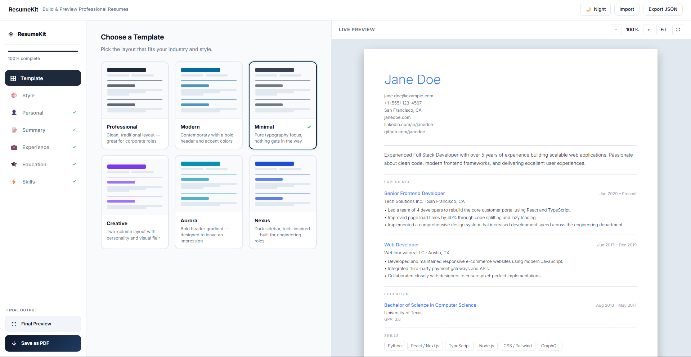
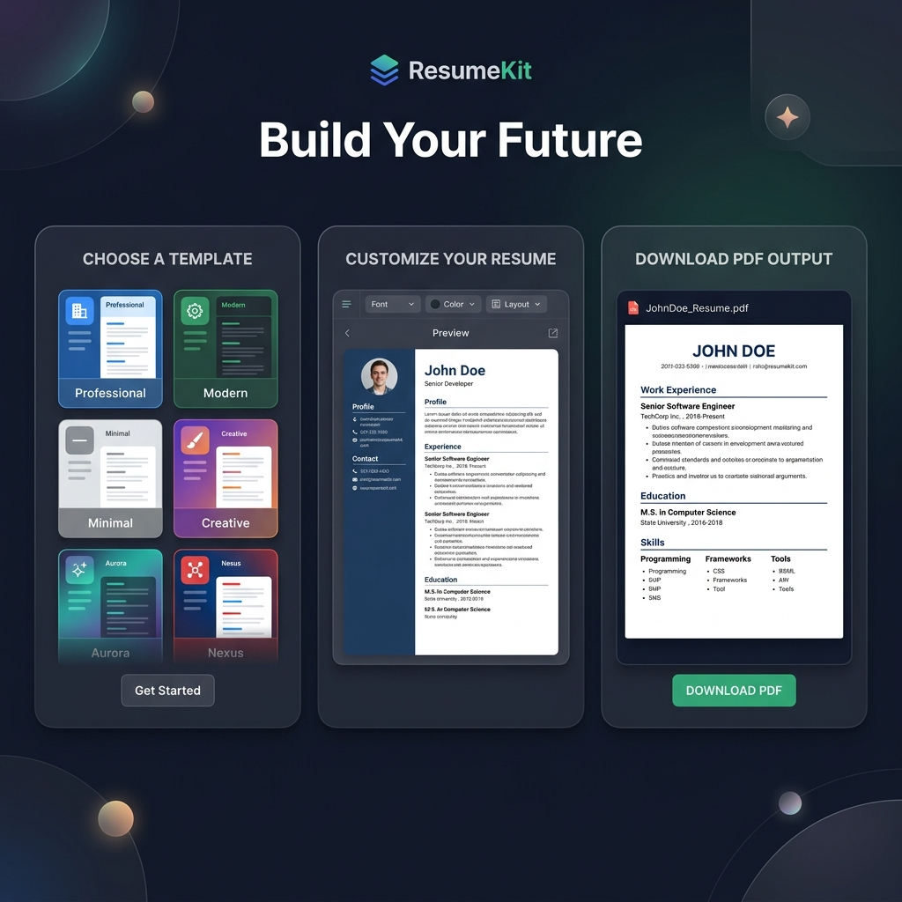

<div align="center">

# ◈ ResumeKit

### Build & Preview Professional Resumes — Instantly

**A blazing-fast, browser-based resume builder with live preview, 6 stunning templates, and clean PDF export.**

🚀 **[Live Demo: resumee-kit.netlify.app](https://resumee-kit.netlify.app)**

[](https://react.dev)
[](https://www.typescriptlang.org)
[](https://vitejs.dev)
[](LICENSE)



</div>

---

## ✨ Features

| Feature | Description |
|---|---|
| 🎨 **6 Templates** | Professional, Modern, Minimal, Creative, Aurora, Nexus |
| 👁️ **Live Preview** | Real-time resume preview with zoom & fit controls |
| ⛶ **Full Screen Preview** | Fullscreen modal to review your final resume |
| ⬇️ **Save as PDF** | Clean PDF export with proper filename (`Name_Resume_Date.pdf`) |
| 💾 **Auto-Save** | All data saved in `localStorage` — survives page refresh |
| 🌙 **Dark Mode** | Full dark/light theme toggle |
| 📱 **Responsive** | Works on desktop, tablet, and mobile |
| 🎨 **Style Customizer** | Change font, accent color, text color, dividers |
| ↕️ **Drag & Drop** | Reorder experience, education, and skills entries |
| 📂 **Import / Export** | Save your resume as JSON and reload it anytime |
| ✅ **Progress Tracker** | Sidebar shows completion % for each section |

---

## 🖼️ Screenshots

### App Overview


### Templates & PDF Export


---

## 🚀 Getting Started

### Prerequisites
- [Node.js](https://nodejs.org) v18 or later
- npm v9 or later

### Installation

```bash
# 1. Clone the repository
git clone https://github.com/Abu-Hojayfa/resume-builder.git
cd resume-builder

# 2. Install dependencies
npm install

# 3. Start the development server
npm run dev
```

Open [http://localhost:5173](http://localhost:5173) in your browser.

### Build for Production

```bash
npm run build
npm run preview   # preview the production build locally
```

---

## 📖 Usage Guide

### 1. Choose a Template
Click **Template** in the sidebar and pick from 6 professionally designed layouts.

### 2. Customize the Style
Click **Style** to adjust:
- Font family (Inter, Roboto, Lora, Playfair Display, and more)
- Accent color
- Text color
- Divider style

### 3. Fill in Your Info
Work through each section in the sidebar:
- **Personal** — Name, email, phone, location, website, LinkedIn, GitHub
- **Summary** — Professional summary or objective
- **Experience** — Add multiple jobs; drag to reorder
- **Education** — Add degrees; drag to reorder
- **Skills** — Add skills with proficiency levels; drag to reorder

### 4. Preview & Export
| Button | Location | Action |
|---|---|---|
| **⛶ Final Preview** | Sidebar bottom | Opens fullscreen preview modal |
| **⬇ Save as PDF** | Sidebar bottom | Prints resume as a clean PDF |
| **⛶ (icon)** | Preview panel header | Opens fullscreen modal |
| **Export JSON** | Top header | Downloads your data as `.json` |
| **Import** | Top header | Load a previously saved `.json` file |
| **Print / PDF** | Top header | Direct browser print dialog |

### 5. Data Persistence
Your resume data is **automatically saved** to `localStorage` after every change.
- ✅ Refresh the page → data is still there
- ✅ Close and reopen the tab → data is still there
- ❌ Data is only cleared when you click **Reset Resume** (from the header)

---

## 🗂️ Project Structure

```
src/
├── components/
│   ├── forms/             # Form sections (Personal, Summary, Experience, etc.)
│   ├── templates/         # Resume templates (6 designs)
│   ├── Header.tsx         # Top navigation bar
│   ├── Sidebar.tsx        # Left nav + Final Preview & Save PDF buttons
│   └── ResumePreview.tsx  # Live preview panel + fullscreen modal
├── contexts/
│   ├── ResumeContext.tsx  # Global resume state + localStorage persistence
│   └── ThemeContext.tsx   # Dark/light theme state
├── hooks/
│   └── usePdfExport.ts    # PDF generation via iframe print technique
├── App.tsx                # Root component, layout, fullscreen state
└── index.css              # Design system, all styles
```

---

## 🎨 Templates

| Name | Style |
|---|---|
| **Professional** | Clean, corporate, black & white |
| **Modern** | Two-column, bold accent sidebar |
| **Minimal** | Whitespace-focused, ultra clean |
| **Creative** | Colorful header, expressive layout |
| **Aurora** | Gradient header, soft pastel tones |
| **Nexus** | Dark accent header, sleek typography |

---

## 🛠️ Tech Stack

- **[React 18](https://react.dev)** — UI framework with hooks
- **[TypeScript](https://www.typescriptlang.org)** — Type safety
- **[Vite 7](https://vitejs.dev)** — Build tool & dev server
- **[Vanilla CSS](https://developer.mozilla.org/en-US/docs/Web/CSS)** — Custom design system with CSS variables
- **localStorage API** — Client-side data persistence
- **iframe print API** — Clean PDF generation without external libraries

---

## 📄 License

MIT License — see [LICENSE](LICENSE) for details.

---

<div align="center">
  Made with ❤️ by <a href="https://github.com/Abu-Hojayfa">Abu Hojayfa</a>
</div>
